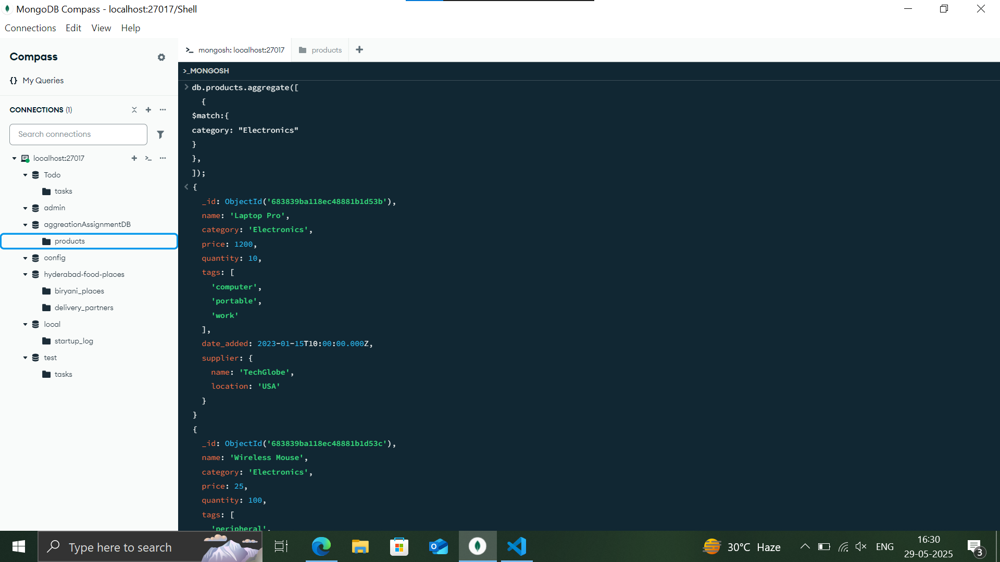
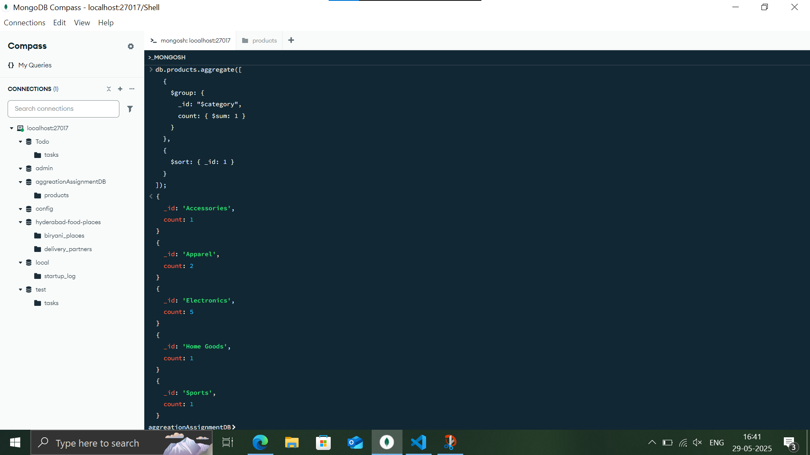
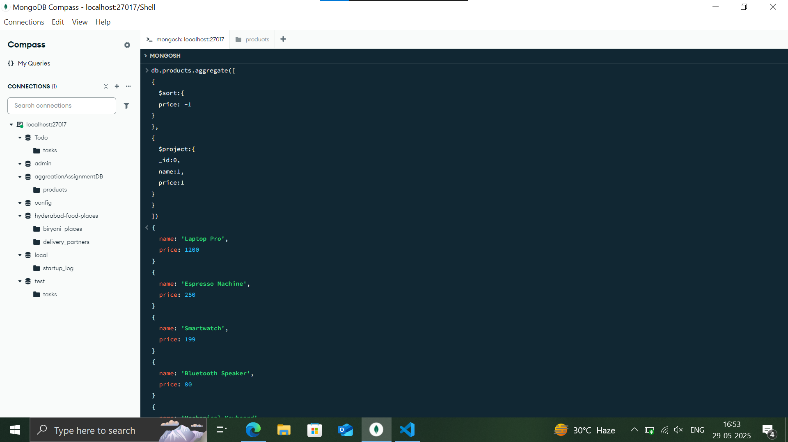

**1. List All Products in the "Electronics" Category:**

- **Task:** Write an aggregation query to find all documents where the `category` is "Electronics".
- **Hint:** Use the `$match` stage.
- **Expected Output (structure, `_id` will vary):**

**2. Count Products per Category:**

- **Task:** Write an aggregation query to count how many products belong to each `category`.
- **Hint:** Use the `$group` stage with the `$sum` accumulator.
- **Expected Output (order might vary):**

**3. Product Names and Prices, Sorted by Price (Descending):**

- **Task:** Write an aggregation query to display only the `name` and `price` of each product, sorted by `price` from highest to lowest. Do not include the `_id` field.
- **Hint:** Use `$project` and `$sort`.

